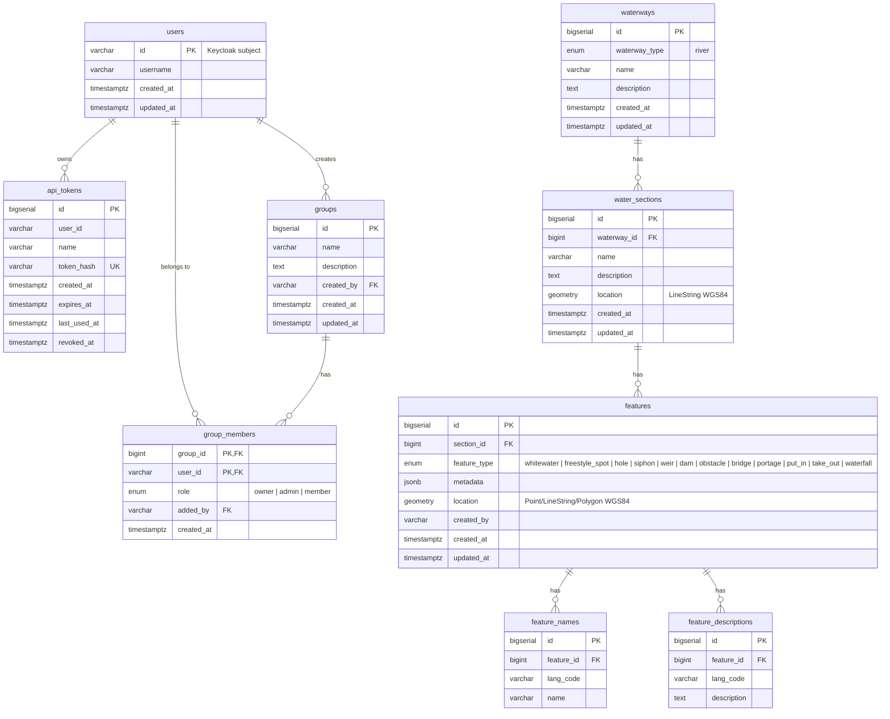

# Paddlemate

Platform for managing whitewater rivers, sections, and features.

## Database Schema

## Authentication

Two authentication methods are supported:

- **Keycloak JWT** — Bearer token via `Authorization` header
- **API Token** — `X-Api-Key: pm_<token>` header

Server admin privileges are granted via the `server_admin` Keycloak realm role.
